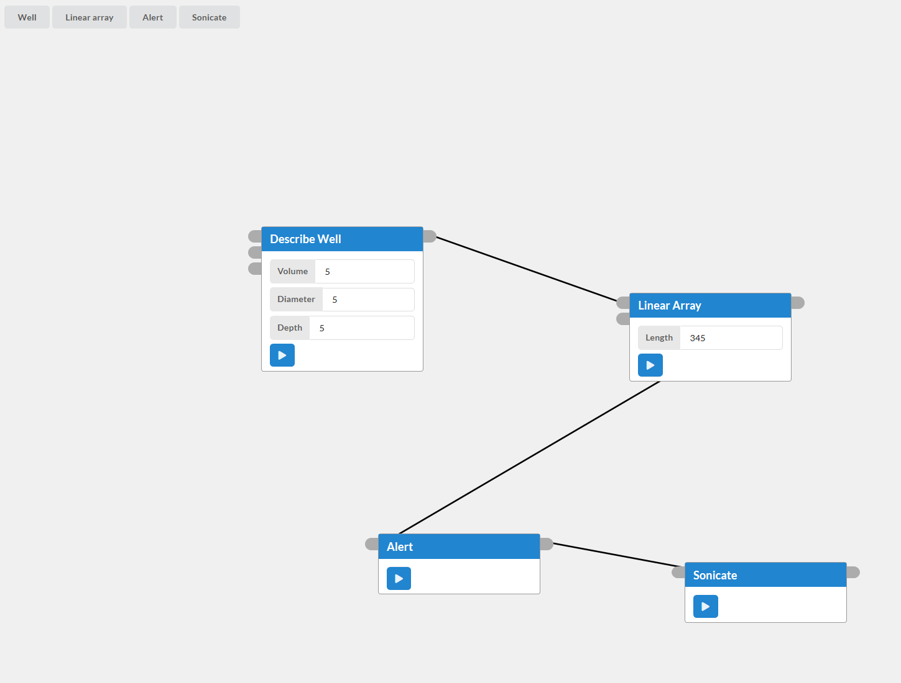
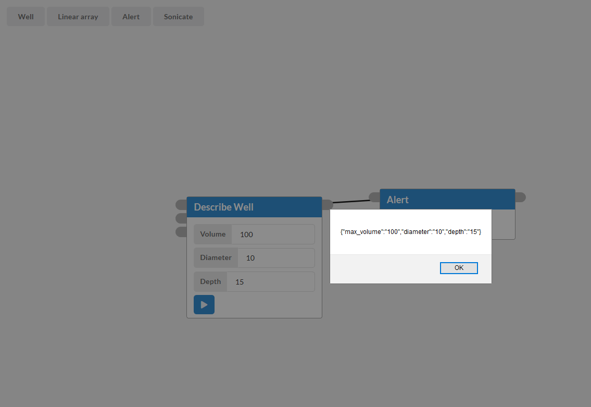

# The Planager

The Planager is a flow-based programming environment that allows you to create
workflows that span digital, physical, and human domains.

## Get started

I did the development for this on the Ubuntu subsystem for Windows, which means
it should work on Unix systems. Ensure you have the latest version of
[node](https://nodejs.org/en/) installed before starting. Clone and download
this repo. In the top-level directory, run `npm install`. This will install all
of the dependencies, which are listed in `package.json`. The dependencies are
installed to `/node_modules`, which is in the `.gitignore`.

## To Run the App

Run `npm start` in the top directory. This will initialize the development
server and open the app in your browser. It is constantly watching for changes
to the code, so every time you save it will refresh the page. Handy!

## Helpful Resources

React developer tools (for
[Firefox](https://addons.mozilla.org/en-US/firefox/addon/react-devtools/) or
[Chrome](https://chrome.google.com/webstore/detail/react-developer-tools/fmkadmapgofadopljbjfkapdkoienihi))
are very comprehensive and great for development.

To understand more about how React works, I recommend going through their
[Tic Tac Toe tutorial](https://reactjs.org/tutorial/tutorial.html).

## Features

You can create a graph of actions, move them around, connect them, provide
inputs, and run them.

Currently supported actions:

- Create Well Object (accepts user input to define a well, then outputs the
  appropriate well object)
- Create Linear Array (Accepts an item and a length, creates an array from them)
- Alert (Displays its data in an alert)
- Sonicate (accepts an array of well objects, outputs sonication instructions)

Here, the alert action displays the well generated by the "describe well"
action: 

Actions accept data from their inports. When the user clicks the "run" button,
it will execute the code that is unique to that action (which can be anything)
and send the result to the appropriate outports. They can run automatically, but
the run button makes debugging a lot easier.

## Next Steps

- I have figured out a decent action component format. Now, I need to create a
  template action and an accompanying API for recieving and sending information
  from an action's custom code.
- Linking components is a bit buggy. I am using React's context API, which
  stores the links in a global context. It works for now, but I think I want the
  Workspace component to be in charge of remembering which actions are linked
  together.
- Inline documentation
- More actions

## Open Questions

- What are different ways to express control flow logic?
- How do we capture provenance?
- What does feedback look like?
- How do we represent physical objects vs digital info, and how to document
  changes to physical objects (like the volume of liquid in a well)?
