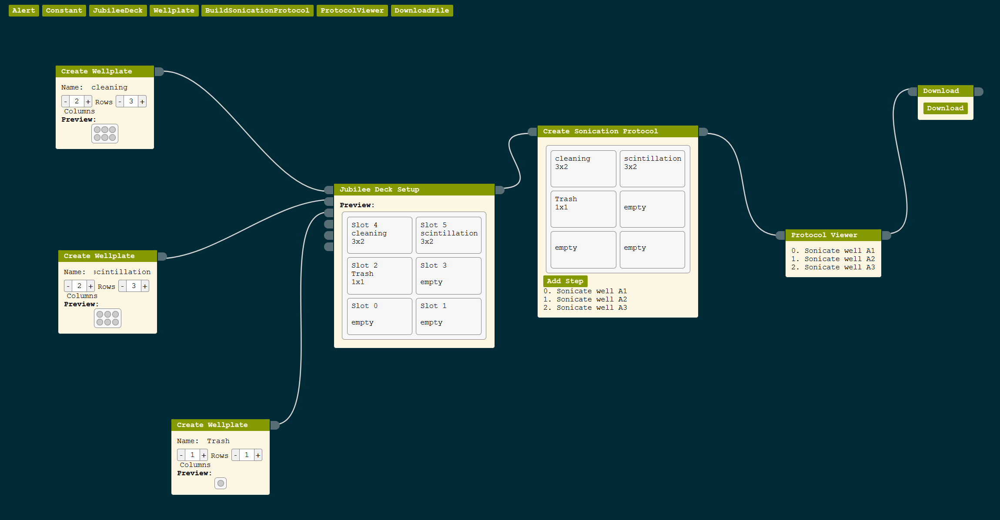
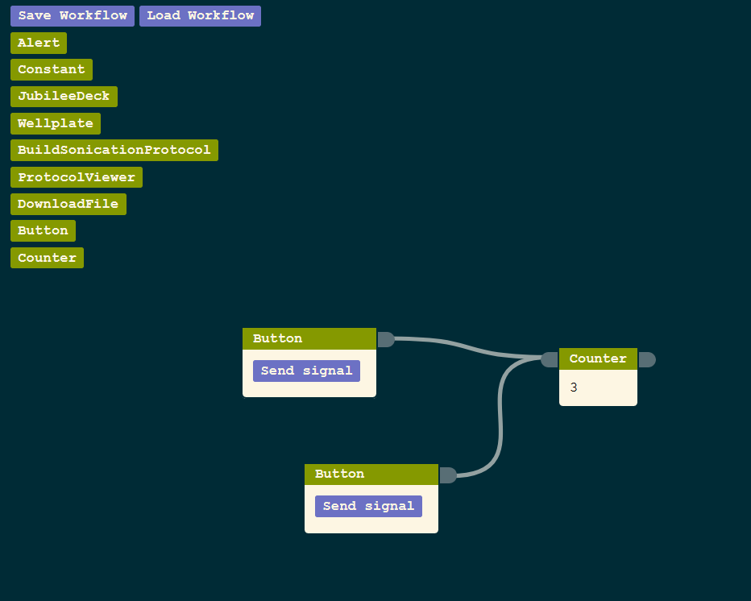

# The Planager

The Planager is a flow-based, end-user programming environment that allows you
to create workflows that span digital, physical, and human domains. Here is an
example workflow for scintillation with a Jubilee CNC that is configured for
pipetting:

Here is an example workflow for incrementing a counter:

## Get started

To run the planager, first ensure you have the latest version of
[node](https://nodejs.org/en/) installed before starting. Clone and download
this repo. Ensure you're running the latest version of npm: `npm update -g`. In
the top-level directory, run `sudo npm install`. This will install all of the
dependencies, which are listed in `package.json`. The dependencies are installed
to `/node_modules`, which is in the `.gitignore` so it will not be committed to
github.

## To Run the App

Run `npm start` in the top directory. This will initialize the development
server and open the app in your browser. It is constantly watching for changes
to the code, so every time you save it will refresh the page. Handy!

## Helpful Resources

- React developer tools (for
  [Firefox](https://addons.mozilla.org/en-US/firefox/addon/react-devtools/) or
  [Chrome](https://chrome.google.com/webstore/detail/react-developer-tools/fmkadmapgofadopljbjfkapdkoienihi))
  are very comprehensive and great for development.
- To understand more about how React works, I recommend going through their
  [Tic Tac Toe tutorial](https://reactjs.org/tutorial/tutorial.html).
