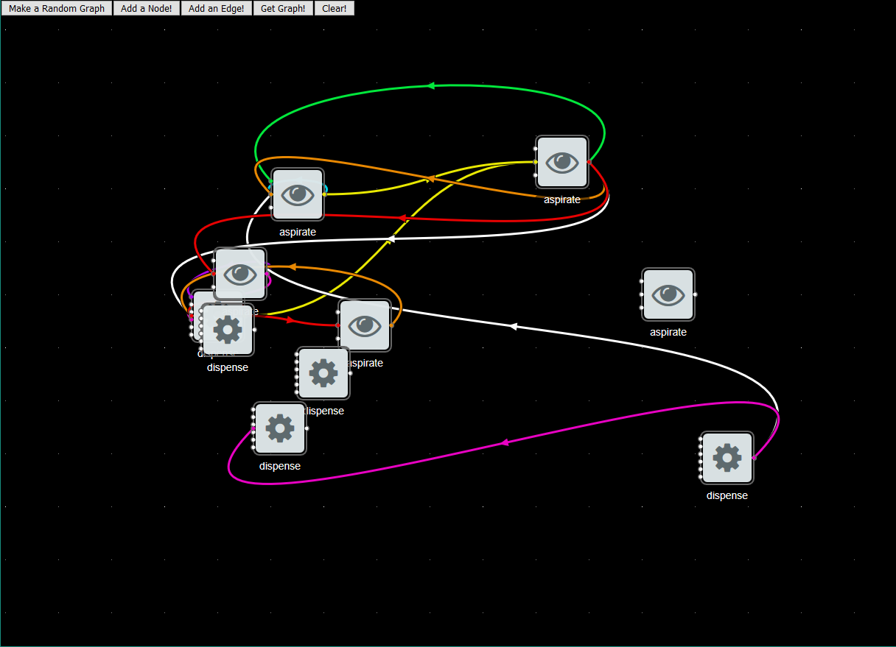
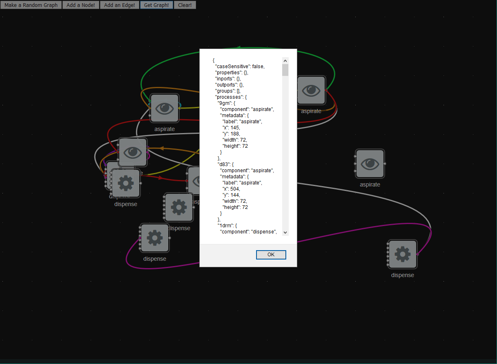

# The Planager

The Planager is a flow-based programming environment that allows you to create
workflows that span digital, physical, and human domains.

## Get started

I did the development for this on the Ubuntu subsystem for Windows, which means
it should work on Unix systems. Ensure you have the latest version of
[node](https://nodejs.org/en/) installed before starting. Clone and download
this repo. In the top-level directory, run `npm install`. This will install all
of the dependencies, which are listed in `package.json`. The dependencies are
installed to `/node_modules`, which is in the `.gitignore`.

## To Run the App

Run `npm start` in the top directory. This will initialize the development
server and open the app in your browser. It is constantly watching for changes
to the code, so every time you save it will refresh the page. Handy!

## Helpful Resources

The [NoFlo documentation](https://noflojs.org/) is sparse but there is some good
stuff in there. The examples are handy for understanding what noflo can do.

The NoFlo creators made
[a series of React components](https://github.com/flowhub/the-graph) for
integrating noflo into React apps. I found the examples they had to be very
useful when I was setting this up, particularly the basic hello world example.

React developer tools (for
[Firefox](https://addons.mozilla.org/en-US/firefox/addon/react-devtools/) or
[Chrome](https://chrome.google.com/webstore/detail/react-developer-tools/fmkadmapgofadopljbjfkapdkoienihi))
are very comprehensive and great for development.

To understand more about how React works, I recommend going through their
[Tic Tac Toe tutorial](https://reactjs.org/tutorial/tutorial.html).

## Features

So far, you can create a dummy graph of dummy actions, connect them, and move
them around. I made a random graph here to demonstrate:

You can also get the json that defines this graph, or "workflow":

Next steps are to add internal logic to the actions, and create a template
action that can be easily copied and modified.
