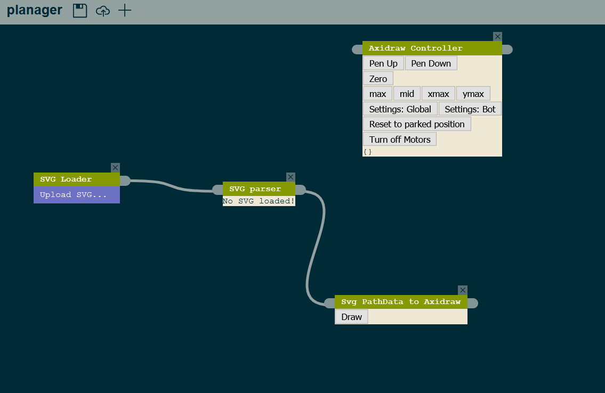
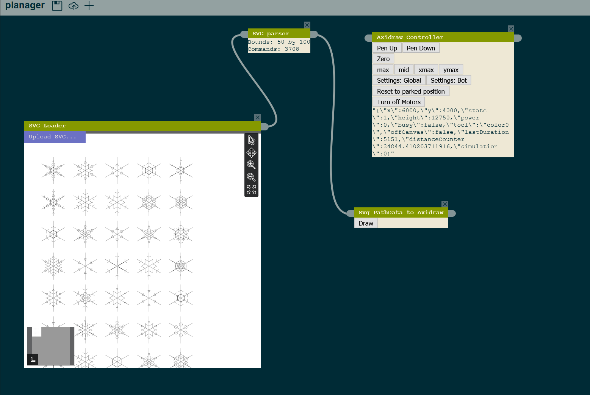

# Using the Planager to Plot with Axidraw

1. Install and run the Planager using the instructions in the main README of this repository.

2. Install [CNC server](https://github.com/techninja/cncserver) using their instructions.

3. In order to run CNCserver with the axidraw, you will need to edit their main config file. Follow the CNC server instructions to connect to the Axidraw. If you don't have an axidraw, the CNCserver will automatically run in simulation mode and instead print the commands it would run to the console.

4. Once both CNCserver and Planager are running, open the Planager in the browser and choose the "upload workflow" option. Upload the axidraw-svg-workflow.json in this repository. The links between actions might not connect properly; this is a known bug. If you drag the actions around they should connect. You should see a workflow layout that looks like this:

5. In the Axidraw controller action, the axidraw should respond accordingly if you click the "Pen Up" and "Pen Down" buttons. Using this action, tturn off the motors, physically move the plotting head to the zero position, and then click "Reset to parked position" to zero the machine. THIS IS IMPORTANT! Axidraw has no limit switches and needs to be told where the zero position is. Now, if you click xmax/ymax/zero, the head will move to the appropriate location.

6. Now we can upload an SVG and plot it! I have verified the SVGs located in this folder to work with this plotting workflow. Using the SVG Loader action, choose an SVG. It will automatically be displayed in the action area, and the SVG parser will compute the bounds and commands required to plot the image. If everything looks good, click "Draw" in the SVG Pathdata to Axidraw action in order to plot the image!

