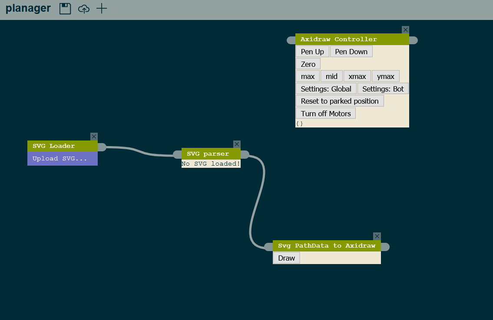

# Using the Planager to Plot with Axidraw

1. Install and run the Planager using the instructions in the main README of this repository.

2. Install (CNC server)[https://github.com/techninja/cncserver] using their instructions.

3. In order to run CNCserver with the axidraw, you will need to edit their main config file. Follow the CNC server instructions to connect to the Axidraw. If you don't have an axidraw, the CNCserver will automatically run in simulation mode and instead print the commands it would run to the console.

4. Once both CNCserver and Planager are running, open the Planager in the browser and choose the "upload workflow" option. Upload the axidraw-svg-workflow.json in this repository. You should see a layout that looks like this:

5. In the Axidraw action, the axidraw should respond if you click the "pen up" and "pen down" buttons. Using this action, you can also turn off the motors in order to move the plotting head to the zero position, and then click "zero" to zero the machine.

6. Now, we can upload an SVG and plot it! I have verified the SVGs located in this folder to work with this plotting workflow.